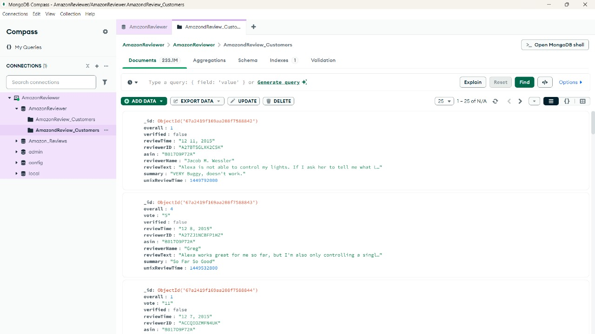
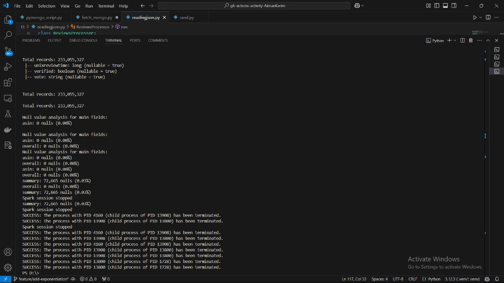
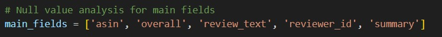

# Apache-Spark-Data-Loading
- Using Amazon Review Data Analysis 
# Assignment 0
## Overview
This project implements large-scale data processing of the Amazon Review dataset using Apache Spark and MongoDB. We decided to implement this locally to optimize it and save time due to storage constraints on other tools like Databricks, google colab etc. The implementation provides two approaches:
- MongoDB pipeline: Data loaded to MongoDB first, then processed via PySpark
- Direct JSON processing: Data processed directly from JSON files using PySpark

## Prerequisites
- Python 3.8+
- Java 8/11
- Apache Spark 3.4.0
- MongoDB 6.0+
- WinUtils (for Windows users)

## Environment Setup

### 1. System Environment Variables
Add the following to system environment variables:
```
JAVA_HOME=C:\Program Files\Java\jdk1.8.0_xxx
SPARK_HOME=C:\spark-3.4.0-bin-hadoop3
HADOOP_HOME=C:\hadoop
PATH=%PATH%;%SPARK_HOME%\bin;%HADOOP_HOME%\bin
```

### 2. WinUtils Setup (Windows Only)
1. Download winutils.exe
2. Place in `C:\hadoop\bin\`
3. Verify with: `winutils.exe chmod -R 777 C:\tmp\hive`

### 3. Virtual Environment
```bash
python -m venv venv
source venv/bin/activate  # Windows: .\venv\Scripts\activate
```

### 4. Dependencies
```bash
pip install pyspark pymongo
```

## Project Structure
```
project/
├── pymongo_script.py      # MongoDB data loading
├── fetch_mongo.py         # Data retrieval from MongoDB
├── readingjson.py         # Direct JSON processing
├── logs/
└── data/
```

## Data Processing Approaches

### Approach 1: MongoDB Pipeline
1. Load data to MongoDB:
```python
python pymongo_script.py
```
2. Process data using PySpark:
```python
python fetch_mongo.py
```

### Approach 2: Direct JSON Processing
```python
python readingjson.py
```
## JSON schema
- 
  
## Output Statistics

- Total records: 233,057,327
- Null records: 72,665
- 

## Known Issues and Solutions

1. File Path Escape Sequence
- Issue: Windows path separators causing errors
- Solution: Use raw strings (r"path") or forward slashes

2. Duplicate Columns
- Issue: Schema inference creating duplicate column names
- Solution: Explicit schema definition in PySpark

3. Malformed Records
- Issue: JSON parsing errors
- Solution: Using permissive mode in Spark reader
```python
df = spark.read.json(path, mode="PERMISSIVE")
```

## Error Handling
- Implemented try-catch blocks for MongoDB operations
- Used Spark's built-in error handling for malformed records
- Logging implemented for tracking issues

## Performance Optimization
- Configured proper partition sizes
- Implemented batch processing for MongoDB operations
- Memory optimization via Spark configurations

## Usage Notes
1. Ensure sufficient disk space (80GB+) for uncompressed data
2. Monitor MongoDB memory usage during initial load
3. Adjust Spark memory settings based on available RAM

## Troubleshooting
1. MongoDB Connection Issues:
```bash
mongod --dbpath /path/to/data
```

2. Spark Memory Issues:
```python
spark.conf.set("spark.driver.memory", "4g")
spark.conf.set("spark.executor.memory", "4g")
```
## Bonus 
- Explicitly define the schema instead of relying on dynamic inference.
 


# Assignment 1
# MAIN SCHEMA

## Initial Data Loading
- The dataset was loaded from a compressed JSON format (gzip) to efficiently handle large file sizes.
- A sampling approach was used to extract a manageable subset of records for preliminary analysis.
- The data was parsed line by line, with error handling for malformed JSON records.
- Only a limited number of rows were initially processed to facilitate exploratory work.

## Data Cleaning and Preparation
- Selected key columns for analysis, including:
  - Review text and summary
  - Product ID (ASIN)
  - Rating score
  - Review timestamp
  - Verification status
  - Reviewer ID
- Identified and quantified missing values across all columns.
- Verified and documented data types for each column.

## Exploratory Data Analysis (EDA)
### Descriptive Statistics
- Generated summary statistics for all numeric columns.
- Analyzed the distribution of review ratings.
- Documented the shape and structure of the dataset.
- Created comprehensive missing value reports to assess data completeness.

### Product Analysis
- Identified the most frequently reviewed products.
- Calculated average ratings per product.
- Examined the relationship between product popularity and average ratings.
- Highlighted top-rated products based on both rating and review count.

### Review Content Analysis
- Calculated review text length and examined its correlation with ratings.
- Identified common words and phrases using word cloud visualization.
- Detected negative keywords in reviews using a predefined list.
- Performed sentiment analysis to categorize reviews as positive, neutral, or negative.

### Verification Analysis
- Compared ratings between verified and non-verified purchases.
- Examined differences in review content and sentiment based on verification status.

## Generated Queries and Insights
### Query 1: Most Reviewed Products
- Identified products with the highest number of reviews.
- Visualized product popularity using bar charts.
- Analyzed what makes certain products receive more reviews.

### Query 2: Review Length vs. Rating
- Examined the correlation between review length and rating score.
- Calculated average review length by rating category.
- Visualized the relationship using scatter plots and bar charts.

### Query 3: Verified vs. Non-verified Purchases
- Compared average ratings between verified and non-verified purchases.
- Analyzed the distribution of verification status across the dataset.
- Visualized differences using comparative bar charts.

### Query 4: Negative Keywords Analysis
- Identified reviews containing predefined negative keywords.
- Calculated the percentage of reviews with negative sentiment.
- Visualized the distribution using pie charts.
- Generated word clouds for negative reviews to identify common issues.

### Query 5: Correlation Analysis
- Created a correlation matrix for numeric variables.
- Examined relationships between review length, rating, and other metrics.
- Visualized correlations using heatmaps.

## Visualizations
### Distribution Visualizations
- Rating distribution bar chart showing the frequency of each rating score.
- Pie chart displaying the proportion of positive, neutral, and negative sentiments.
- Scatter plot illustrating the relationship between review length and rating.

### Product Analysis Visualizations
- Bar chart of the most reviewed products.
- Scatter plot showing product rating versus popularity.
- Bar chart highlighting top-rated products.

### Text Analysis Visualizations
- Word cloud representing common terms in reviews.
- Specialized word cloud for negative reviews.
- Bar chart showing sentiment distribution across different rating categories.

### Business Insights Visualizations
- Gauge chart displaying overall average product rating.
- Heatmap visualizing correlations between numeric variables.
- Bar chart comparing verified versus non-verified purchase ratings.

## Output and Reporting
- All visualizations were saved in HTML format using Plotly for interactive exploration.
- Word clouds and heatmaps were saved as PNG images.
- Summary statistics and analysis results were stored in CSV format.
- Comprehensive logging was implemented to track the analysis process.
- Results were organized in dedicated directories for easy access and review.


# BONUS PART
## **Overview**
In this bonus question, we performed **data preprocessing and exploratory data analysis (EDA)** on a given dataset to clean, analyze, and visualize important trends. Below is a step-by-step breakdown of our approach.


## **Step 1: Data Preprocessing**
### **1.1 Loading the Dataset**
The dataset was loaded into a Spark DataFrame for efficient processing. We examined the schema and data types to understand the dataset's structure.

### **1.2 Handling Missing Values**
- We checked for missing values in each column.
- Columns with a high percentage of missing data were dropped.
- Missing values were filled with the mean or median for numerical columns.
- Missing values were filled using mode or a placeholder value for categorical columns.

### **1.3 Identifying and Removing Outliers**
- Any value that was more than three standard deviations away from the mean was considered an outlier and removed.

## **Step 2: Exploratory Data Analysis (EDA)**
### **2.1 Understanding the Data Distribution**
- We computed basic statistics such as **mean, standard deviation, min, and max** for numeric columns.
- This provided an initial understanding of the dataset’s distribution.

### **2.2 Identifying Unique Values**
- We extracted distinct values from categorical columns to understand their diversity.
- This helped in identifying potential data inconsistencies.

### **2.3 Frequency Analysis**
- We counted occurrences of different values in categorical columns.
- This allowed us to detect dominant values and potential imbalances in the dataset.

### **2.4 Filtering and Conditional Analysis**
- We filtered records based on specific conditions, such as selecting rows where a column's value exceeded a threshold.

## **Step 3: Data Visualization**
### **3.1 Distribution Plots**
- Histograms and density plots were generated to understand the distribution of numerical features.
- This helped in detecting skewness or anomalies in the data.

### **3.2 Correlation Analysis**
- A correlation matrix was created to identify relationships between numerical variables.
- Highly correlated features were noted for potential feature selection.

### **3.3 Bar Charts for Categorical Data**
- The frequency of categorical values was visualized using bar charts.
- This provided insights into the most common categories in the dataset.

### **3.4 Box Plots for Outlier Detection**
- Box plots were used to visualize outliers in numerical columns.
- This confirmed the effectiveness of our outlier removal step.


## **Conclusion**
Through this step-by-step data preprocessing and EDA process, we cleaned the dataset, removed anomalies, and extracted meaningful insights. These steps prepared the dataset for further modeling and analysis, ensuring better data quality and reliability.


## Contributors
- Zaib Un Nisa 21i-0383
- Aiman Karim 21i-0664
  
